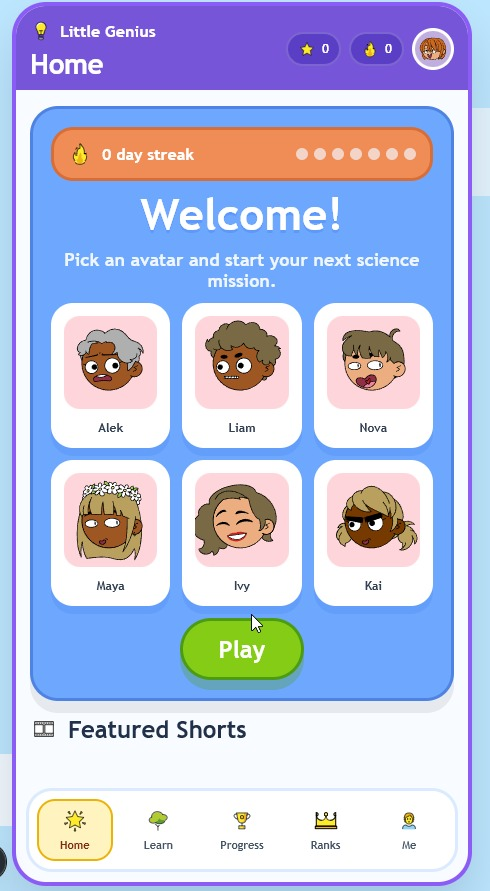
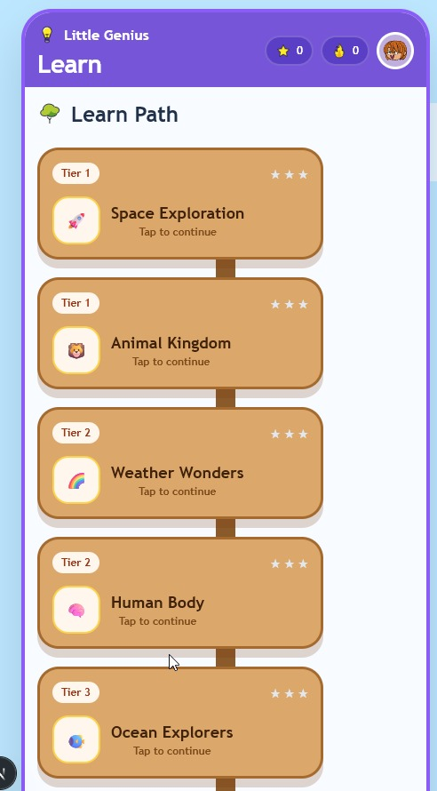
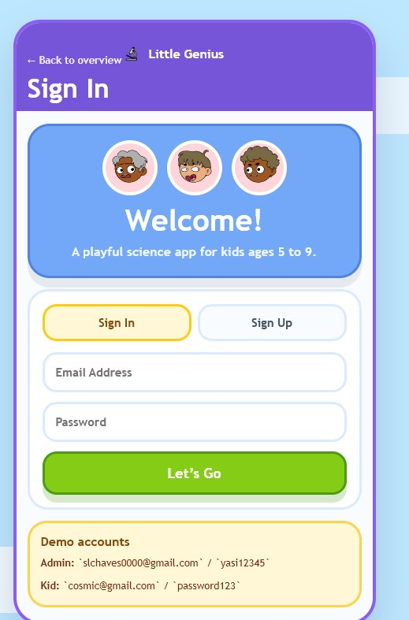
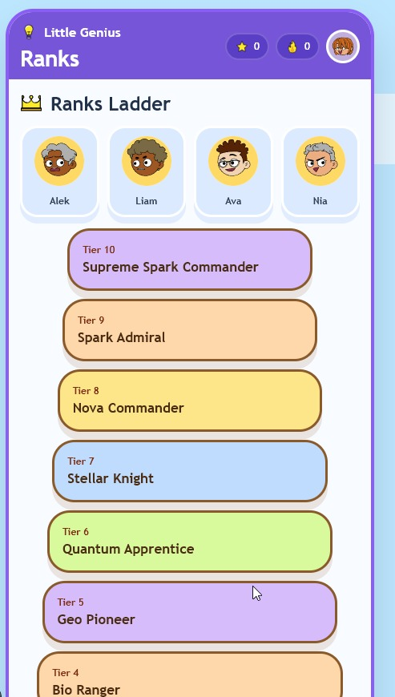
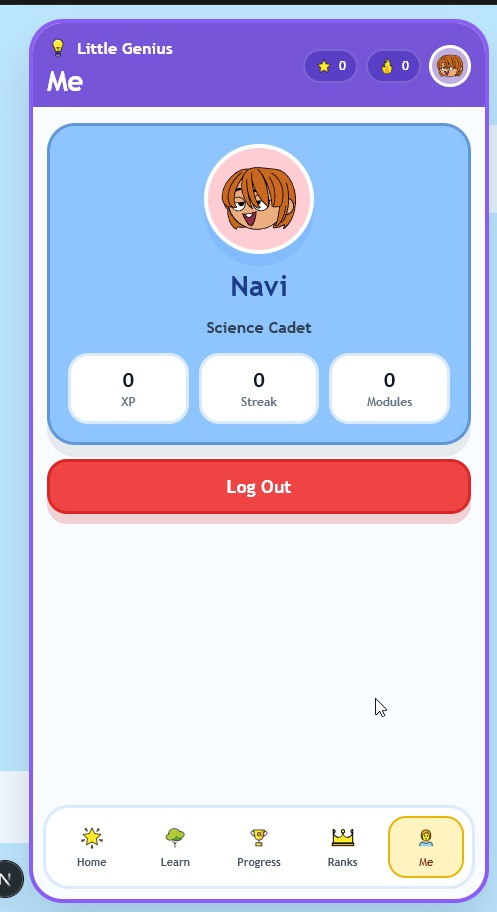
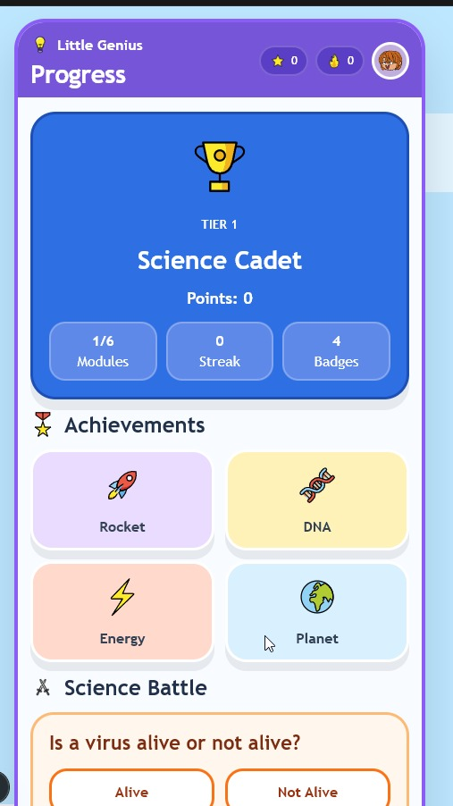
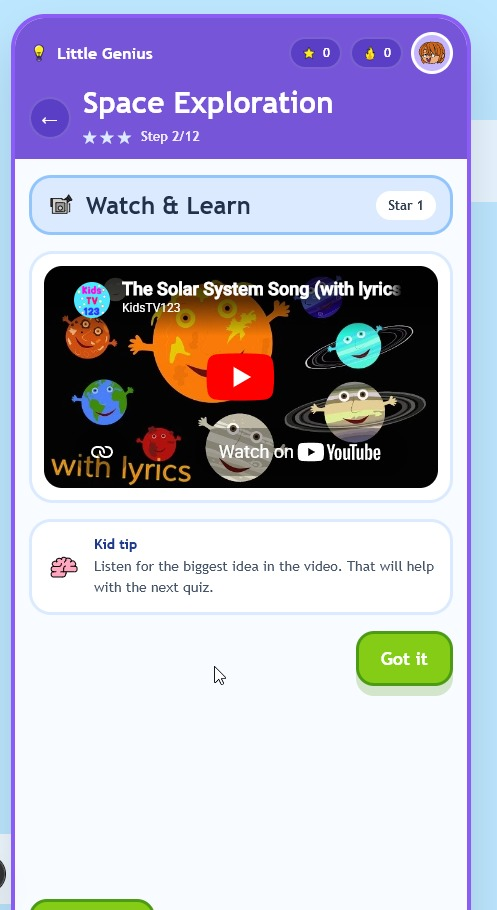
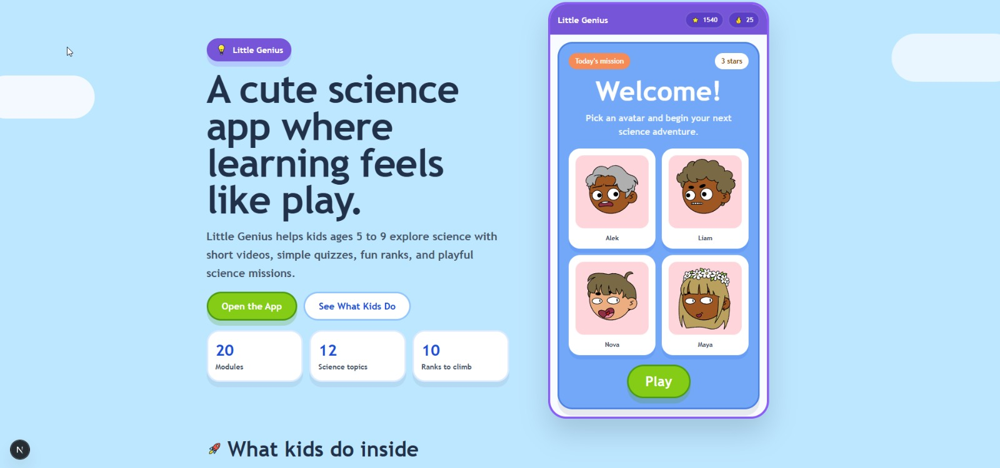
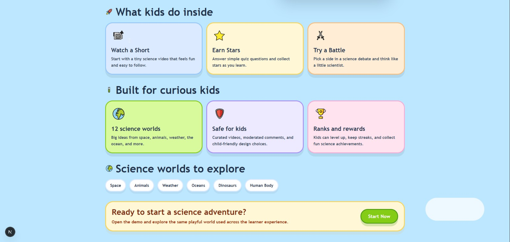

# Little Genius 🔬

A premium, interactive, and gamified science learning platform designed specifically for kids aged 5 to 9. Featuring visual science paths, interactive quizzes, engaging mini-videos, a comprehensive ranking/badge system, and a robust admin dashboard.

---

## 📸 App Preview

Here is a look inside the **Little Genius** learning adventure:

| 🗺️ Interactive Path | ⚡ Science Battle | 🏅 Achievement Badges |
|:---:|:---:|:---:|
|  |  |  |

| 🧑‍🚀 Profile & Progress | 🧠 Interactive Quizzes | 🏅 Ranks Ladder |
|:---:|:---:|:---:|
|  |  |  |

| ⚙️ Admin Dashboard | 📦 Module Management | 👥 User Controls |
|:---:|:---:|:---:|
|  |  |  |

---

## ✨ Features

### 🧑‍🚀 For Young Scientists (Kids UX)
- **🗺️ Interactive Learn Path**: Glossy, Duolingo-style visual science roadmaps representing modules across multiple tiers (Space, Chemistry, Biology, Physics, Energy, Planet).
- **📹 Watch & Learn**: Bite-sized, educational video lessons with progress tracking (+5 XP).
- **🧠 Star Quizzes**: Interactive question engine where kids earn stars (up to 3 per module) for passing quizzes, with animated perfect-score bonuses (+10 XP).
- **⚔️ Science Battle**: Fun, kid-friendly debating matches (e.g., *"Is a virus alive or not alive?"*) where kids vote and compare scientific arguments (+25 XP).
- **🏅 Ranks & Badge Progression**: Climb 10 rank levels (from *Science Cadet* to *Supreme Spark Commander*) and unlock shiny badges (e.g., *Streak Master*, *Quiz Whiz*) based on XP milestones and consistency.
- **🔥 Daily Streak System**: Daily logins are recorded via `daily_logs` to reward kids and track their daily streak.
- **✨ Animated Delight**: Powered by `canvas-confetti` celebrations on module completion and floating XP bubbles!

### ⚙️ For Teachers & Parents (Admin Panel)
- **📊 Content Health Analytics**: View quiz pass rates, module completions, and popular categories.
- **📦 Module Builder**: Create, edit, draft, publish, and order learning paths and lessons.
- **▶️ Shorts & Video Uploader**: Manage short videos, durations, and domains with automatic Supabase storage uploaders.
- **👥 User Manager**: Track student XP, update/suspend accounts, or reset passwords.

---

## 🛠️ Technology Stack
- **Framework**: Next.js 16 (App Router with Turbopack)
- **Frontend**: React 19, CSS (modern custom styled-components layout)
- **Backend/Database**: Supabase SSR (Auth, PostgreSQL, Storage, RLS)
- **Visuals & Delight**: OpenMoji, Dicebear avatars, `canvas-confetti`

---

## 🚀 Getting Started (Run Locally)

### Prerequisites
- Node.js (v18 or higher recommended)
- A Supabase account (free tier works perfectly)

### 1. Clone the repository
```bash
git clone https://github.com/godragun/littlegenius.git
cd littlegenius
```

### 2. Install dependencies
```bash
npm install
```

### 3. Database Setup (Supabase)
Create a new project on your Supabase dashboard and run the following in the **SQL Editor**:
1. Execute [supabase/schema.sql](./supabase/schema.sql) to set up tables, RLS policies, indexes, and triggers.
2. Execute [supabase/seed-content.sql](./supabase/seed-content.sql) to populate standard ranks, badges, modules, lessons, and sample quizzes.

### 4. Configure Environment Variables
Copy `.env.example` to `.env.local` and fill in your Supabase project keys:
```bash
cp .env.example .env.local
```
Add your credentials:
```env
NEXT_PUBLIC_SUPABASE_URL=https://your-project-id.supabase.co
NEXT_PUBLIC_SUPABASE_ANON_KEY=your-anon-key-here
```

### 5. Run the development server
```bash
npm run dev
```
Open **`http://localhost:3000`** (or `http://localhost:3001`) in your browser.

---

## 👥 Login Credentials (Demo)

- **Admin Account**:
  - **Username**: `admin`
  - **Password**: `admin123`
- **User/Kid Account**:
  - Enter any username with 3+ characters to create or sign in to a student profile!

---

**Built with ❤️ for young scientists**
